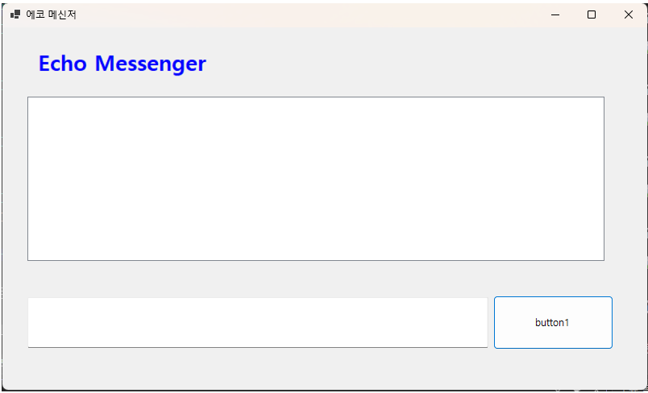
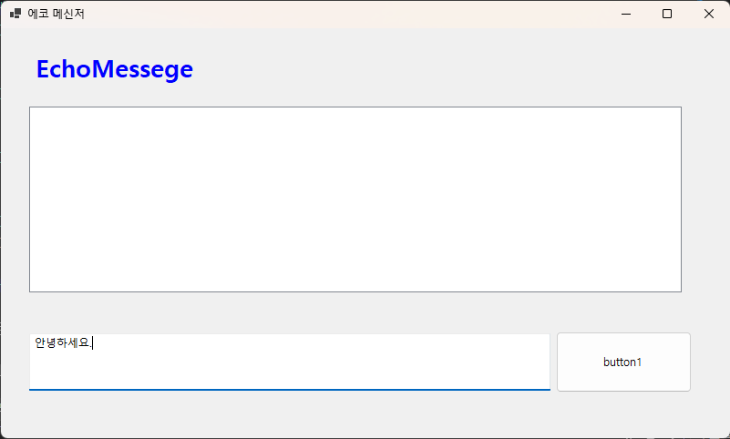
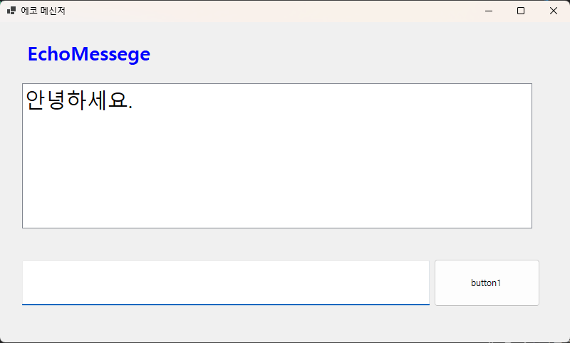
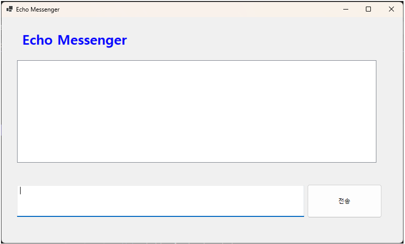
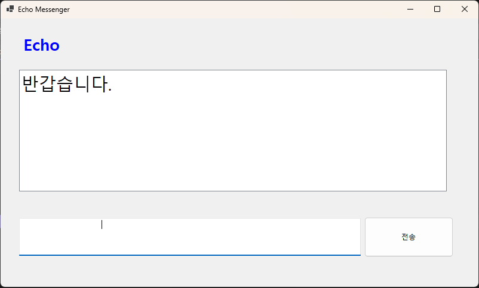
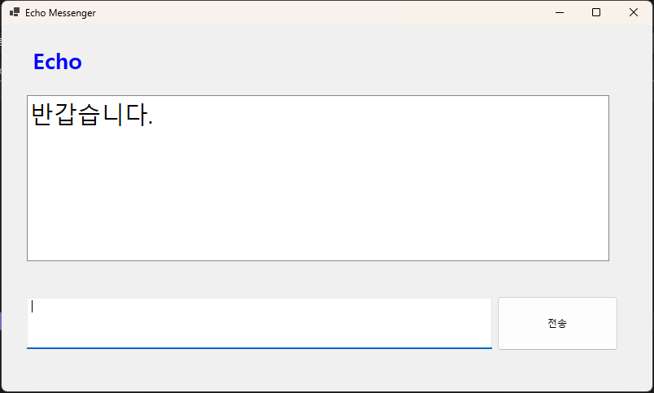
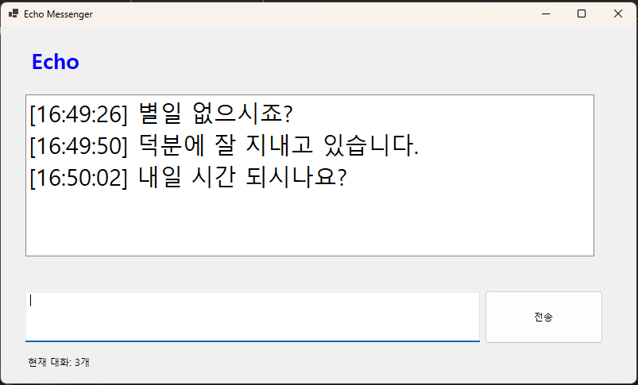
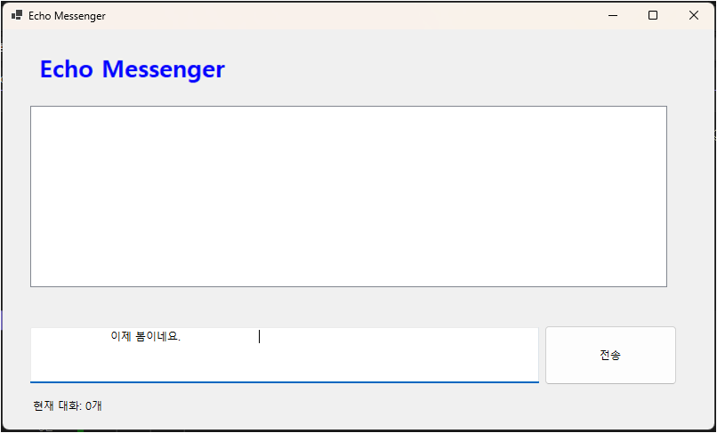
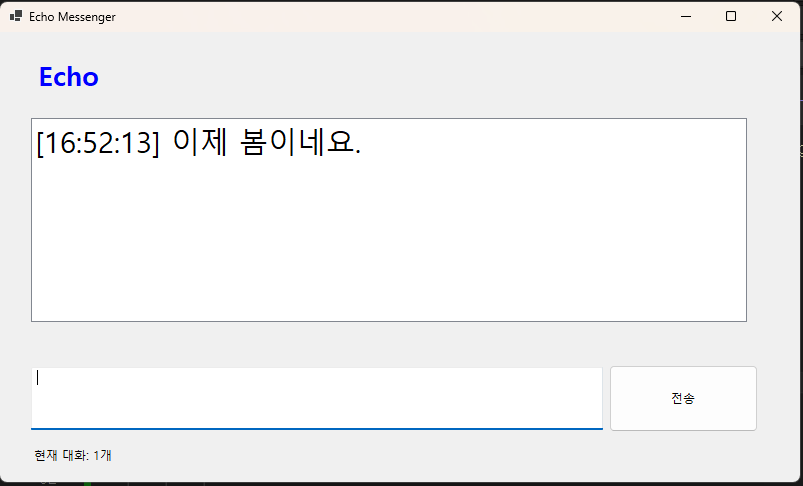

# C# 코딩 - 에코 메신저

## 1. 프로젝트 개요

본 프로젝트는 **C# Windows Forms**를 사용하여 만든 간단한 **에코 메신저 프로그램**입니다.  
사용자가 입력한 메시지를 버튼 클릭으로 화면에 출력하는 방식으로 구현하였습니다.

에코 메신저는 사용자가 입력한 내용을 그대로 다시 보여주는 프로그램으로,  
이번 실습에서는 **텍스트 입력 처리**, **버튼 클릭 이벤트 처리**, **리스트박스 출력**,  
**입력창 초기화 및 포커스 이동** 기능을 중심으로 구현하였습니다.

---
---

## 2. 개발 환경

- Language : C#
- Framework : .NET Windows Forms
- IDE : Visual Studio 2026
- Version Control : GitHub

---
---

## 과제 1. 실행 화면
### 과제 1-1. 기본 실행 화면


기본 실행 화면으로, 프로그램 제목과 입력창, 버튼, 출력 리스트박스가 배치됨

### 과제 1-2. 메시지 입력


사용자가 텍스트박스에 메시지를 입력한 모습

### 과제 1-3. 메시지 출력


버튼 클릭 후 입력한 메시지가 리스트박스에 출력된 모습

## 과제 1. 사용한 컨트롤

본 프로젝트에서는 Windows Forms의 기본 컨트롤을 활용하여 화면을 구성하였습니다.

- **Label**
  - 프로그램 제목인 `EchoMessege`를 화면 상단에 출력하기 위해 사용
- **TextBox**
  - 사용자가 메시지를 입력하기 위해 사용
- **ListBox**
  - 입력한 메시지를 목록 형태로 출력하기 위해 사용
- **Button**
  - 입력한 메시지를 전송하는 기능을 수행하기 위해 사용

---

## 과제 1. 구현한 기능

### 과제 1-1. 메시지 입력 기능
사용자가 하단의 텍스트박스(`txtmsg`)에 원하는 문장을 입력할 수 있도록 구현하였습니다.

### 과제 1-2. 버튼 클릭 시 메시지 출력 기능
버튼(`button1`)을 클릭하면 텍스트박스에 입력된 문자열을 읽어와  
리스트박스(`listBox1`)에 추가되도록 구현하였습니다.

### 과제 1-3. 입력창 초기화 기능
메시지가 전송된 뒤에는 기존 입력 내용을 지우기 위해  
`txtmsg.Clear();` 코드를 사용하여 입력창을 비우도록 하였습니다.

### 과제 1-4. 포커스 이동 기능
메시지를 전송한 뒤 사용자가 다시 바로 입력할 수 있도록  
`txtmsg.Focus();` 코드를 사용하여 커서를 입력창으로 다시 이동시켰습니다.

---

## 과제 1. 소스 코드 설명

버튼 클릭 이벤트의 핵심 코드는 아래와 같습니다.
```csharp
private void button1_Click(object sender, EventArgs e)
{
    string typed_msg;
    typed_msg = txtmsg.Text;
    listBox1.Items.Add(typed_msg);
    txtmsg.Clear();
    txtmsg.Focus();
}
```
---
---


## 과제 2. 실행 화면
### 과제 2-1. 처음 실행 화면
 
Shown 이벤트에서 포커스를 주어 처음 Form 로딩시 입력창에 포커스가 가도록 기능 추가

### 과제 2-2. 입력 방어 기능
 

스페이스 문자 입력시 메시지가 전송되지 않도록 기능 추가

### 과제 2-3. 메시지 출력
 

스페이스 문자 입력시 메시지가 전송되지 않은 결과 화면

---

## 과제 2. 구현한 기능

### 과제 2-1. 엔터키로 전송하기
txtmsg_KeyDown 이벤트 핸들러를 추가하여 사용자가 엔터키를 눌렀을 때 메시지가 전송되도록 구현

### 과제 2-2. 입력방어 기능
string.IsNullOrWhiteSpace API를 사용하여 입력된 메시지가 공백이거나 비어있는 경우 메시지가 전송되지 않도록 구현

### 과제 2-3. 폼 처음 로드시 입력창에 포커스 기능 추가
생성자에 Shown 이벤트 등록 및 Shown 이벤트 핸들러 추가하여 폼이 처음 로드될 때 입력창에 포커스가 가도록 구현

---

## 과제 2. 소스 코드 설명

* 엔터키로 전송 이벤트의 핵심 코드는 아래와 같습니다.
```csharp
private void txtmsg_KeyDown(object sender, KeyEventArgs e)
{
    if (e.KeyCode == Keys.Enter)
    {
        e.SuppressKeyPress = true;
        SendMessage();
    }
}

* 입력방어 기능의 핵심 코드는 아래와 같습니다.
```csharp
private void SendMessage()
{
    string typed_msg = txtmsg.Text;

    if (string.IsNullOrWhiteSpace(typed_msg))
    {
        txtmsg.Clear();
        txtmsg.Focus();
        return;
    }
    . . . . .
}
```
---
---

## 과제 3. 실행 화면
### 과제 3-1. 타임스탬프와 메시지 카운팅


리스트박스에 타입스탬프를 표시하고 폼의 하단에 리스트에 쌓인 총 메시지 개수를 실시간 업데이트

### 과제 3-2. 문자열 정제(입력)


입력창에 스페이스를 문자열 앞뒤로 입력

### 과제 3-3. 문자열 정제(출력)


스페이스를 제거하고 리스트박스에 출력

---

## 과제 3. 구현한 기능

### 과제 3-1. 타임스탬프
현재시간과 입력메시지를 리스트박스에 Add

### 과제 3-2. 메시지 카운팅
 - 메시지 카운팅 라벨 추가
 - 리스트박스 Count를 실시간으로 보여줌

### 과제 3-3. 문자열 정제
Trim API 함수를 이용하여 입력한 테스트으의 스트링을 정제

---

## 과제 3. 소스 코드 설명

* 타임스탬프 추가의 핵심 코드는 아래와 같습니다.
```csharp
private void SendMessage()
{
    . . . . 
    string messageWithTime = $"[{DateTime.Now:HH:mm:ss}] {typed_msg}";
    listBox1.Items.Add(messageWithTime);
    . . . . 
}

* 메시지 카운팅의 핵심 코드는 아래와 같습니다.
```csharp
private void UpdateMessageCount()
{
    lblCount.Text = $"현재 대화: {listBox1.Items.Count}개";
}

SendMessage 함수에서 UpdateMessageCount 함수를 호출합니다.

* 문자열 정제의 핵심 코드는 아래와 같습니다.
```csharp
private void SendMessage()
{
    string typed_msg = txtmsg.Text.Trim();
    . . . . 
}
```
